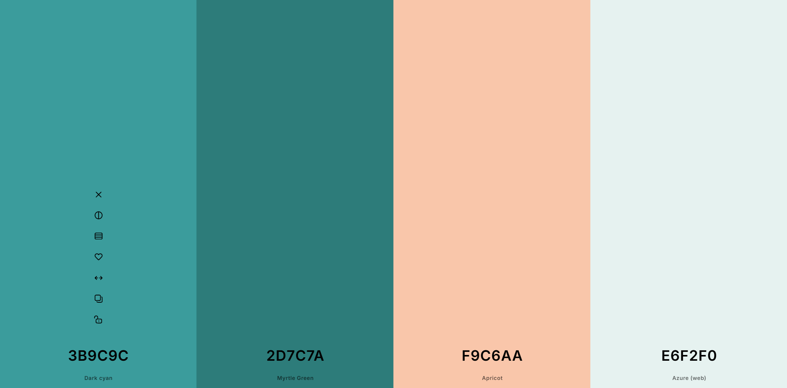
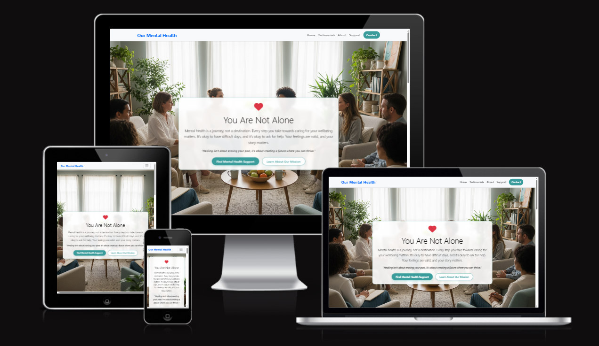
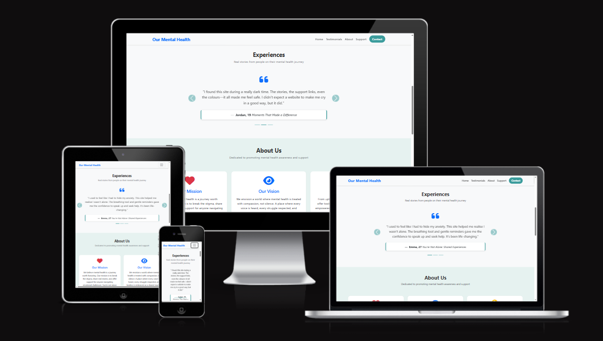
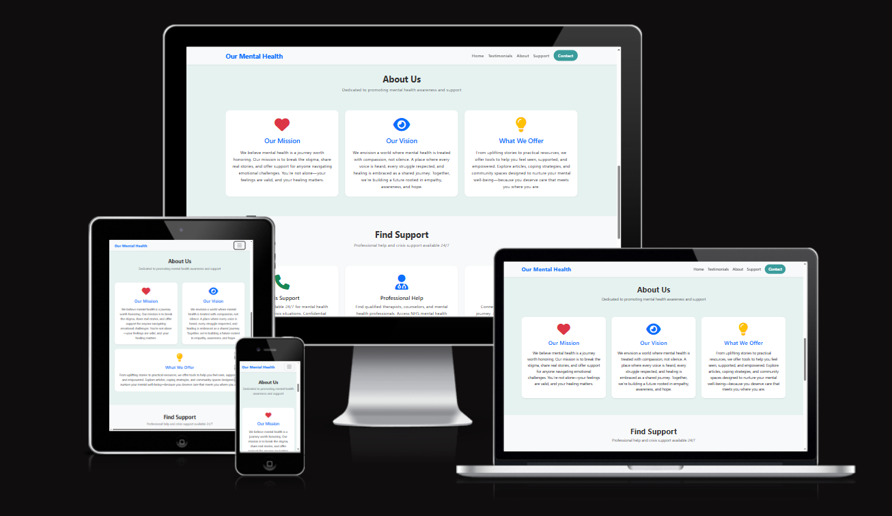
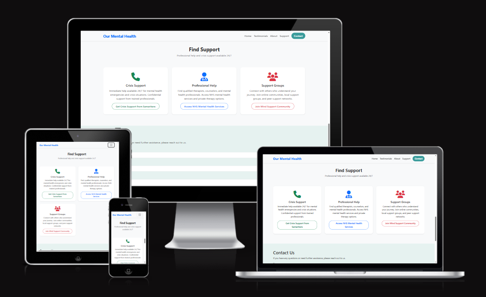
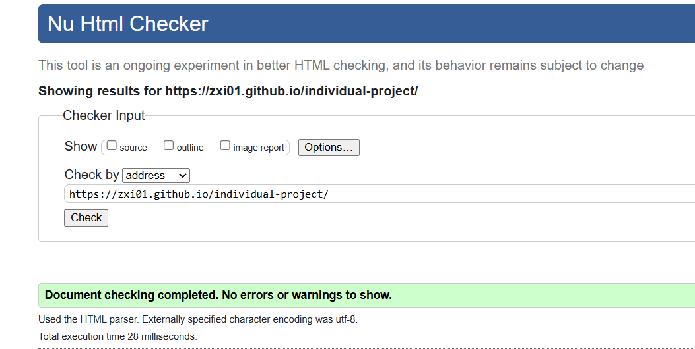

# individual-project

# Our Mental Health

## Overview

### Purpose

Our Mental Health is an interactive website, made to educate, inform and support everyone in understanding mental health and ways to help yourself.

Live Site Link:
[Our Mental Health](https://zxi01.github.io/individual-project/)

### Target Audience

The target audience is aimed at the general public, specifically those who may be going through hard times or struggling with day to day life. Typically towards teenagers/young adults as they are statistically the most affected age group, providing relevant and professional tips and information.

## User Stories/UX design

### Must-Have User Stories

Support Links: Access to appropriate and professional support links for information.
User Experiences: Presented messages of previous user experiences and a brief summary of their stories.

### Should-Have User Stories

Contact: A contact form, enabling users to provide questions, messages or feedback based on their experiences.

### Could-Have User Stories

Public Messaging Area: An area where visitors can share their stories directly to others anonymously or publicly, so people looking for tips can see real life solutions.

## Design Decisions

### Wireframes

The design features:

-   **Hero Section:** Large positive message and an appropriate background
-   **Information Cards:** Grid layout with Bootstrap cards for what we do and external mental health support
-   **Resource Links:** Highlighted hoverable external resources styled with Bootstrap buttons.
-   **Experiences:** Uplifting messages from people in similar situations
-   **Colour palette:**

### Accessibility Considerations

-   **Color Contrast:** Ensures readability.
-   **Alt Text:** Descriptive text for all images.
-   **Keyboard Navigation:** Fully navigable with keyboard shortcuts.
-   **Responsive Design:** Optimized for all devices.

## Features Implementation

### Core Features

-   **Hero Section:** Calming message with background image.
-   **Information Cards:** Bootstrap cards for
-   **Resource Links:** Buttons linking to trusted resources.

## AI Tools Usage

### Google Gemini

Used for generating a supportive image, ensuring a calming and positive visual tone.

### GitHub Copilot

Assisted with efficient coding, including HTML structure, CSS styling, and responsive layout features.

## Testing and Validation

### Testing Results

Tested across multiple devices with Chrome DevTools for responsiveness. I used the Am I Responsive website:

### Lighthouse

### Validation

HTML and CSS passed W3C validation with no errors:

## Deployment

### Deployment Process

Deployed via GitHub Pages. Resolved broken links to ensure all external links opened correctly.

## Reflection on Development Process

### Successes

-   **AI Tools:** Enhanced development speed and design with GitHub Copilot
-   **Design:** Balanced aesthetics with accessibility.

### Challenges

Ensuring accessibility and color contrast while maintaining a calm and aesthetic design.

### Final Thoughts

This project explores design, and web development, focusing on accessibility and user-centered design within the mental health topic

## Future Improvements

-   **Community Area:** Create a place for visitors to connect and share experiences with each other.

## Code Attribution

### Bootstrap Framework:

The website utilises the Bootstrap framework for responsive design and styling components like the navigation bar, cards, and the form in the contact section.

### Icons:

Icons used, such as the socials icons in the footer, were sourced from Font Awesome.

### External Resources:

The following external resources have been carefully curated to provide credible and supportive information on mental health topics relevant to the audience of "Our Mental Health":

[Samaritans](https://www.samaritans.org/):
A confidential helpline and support service available 24/7 for anyone in emotional distress or struggling to cope.

[NHS Mental Health](https://www.nhs.uk/mental-health/):
The official NHS portal providing trusted information, self-help resources, and access to mental health services across the UK.

[Mind](https://www.mind.org.uk/):
A UK mental health charity offering advice, support, and advocacy to empower anyone experiencing mental health challenges.
These resources provide additional information and support

### Image Attribution:

The image in the hero section background, was generated using Google Gemini
